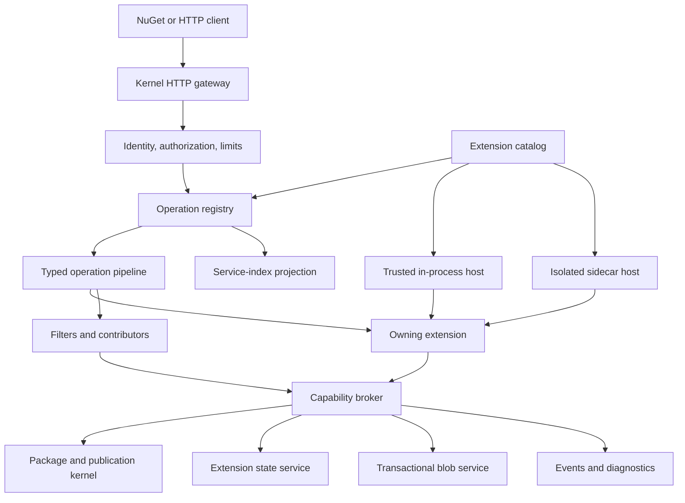

# Microkernel Extension Architecture

## Status

Selected architecture design. Implementation has not started.

This design supersedes the core-first proposal as the intended long-term
architecture. Most NuTestServer features, including the default NuGet V3
implementation, will be built through the same public extension contracts available
to third parties.

## Executive summary

NuTestServer becomes a small, policy-enforcing kernel surrounded by extensions.
The kernel owns only the behavior that cannot safely be delegated:

- Process and host lifecycle.
- Extension discovery, validation, activation, and supervision.
- Authentication, authorization, capability enforcement, and secrets.
- Route ownership, request limits, and response enforcement.
- Durable transaction and blob primitives.
- Package identity and publication invariants.
- Diagnostics, health, and audit attribution.

Everything else is composed as an extension:

- The service index.
- Flat-container resources.
- Registration.
- Search.
- Push, unlist, and delete workflows.
- Vulnerability data.
- Test-control APIs.
- Operations and backup APIs.
- Package staging.
- Future organization-specific resources.

The default CLI installs and activates an official extension bundle, so the normal
user experience remains a complete NuGet server. A minimal profile activates only
the kernel and explicitly selected extensions.

Official and third-party extensions use the same manifests, contribution points,
capability broker, lifecycle, ordering, and tests. Official extensions do not get
private access to server internals.

## Why this design

The earlier design keeps current NuGet operations in the core and adds extension
seams around them. That is the lower-risk migration. This design goes further:
current features are migrated into built-in extensions, making extensibility the
primary composition model rather than an adapter around a monolith.

The benefits are:

- New protocol resources do not require editing the kernel.
- Default behavior demonstrates the supported extension model.
- Features can be omitted, replaced, or independently versioned.
- Test profiles can activate only the behavior a scenario needs.
- Architectural boundaries are continuously exercised by official code.
- Third-party extensions cannot depend on privileged patterns unavailable outside
  the repository.

The cost is a larger initial refactor and stricter API-design responsibility. A bad
public extension contract is harder to change than an internal interface.

## Architectural influences

This proposal combines patterns from established extension systems rather than
copying any one implementation.

### Visual Studio Code

VS Code uses declarative contribution points, activation events, and extension
hosts. Extensions describe contributions in a manifest and are activated only when
needed. Extension code runs separately from the main UI process.

Lessons adopted:

- Contributions are declared before code runs.
- Background extension activation can be lazy; request routes and advertised
  resources remain fixed before listening.
- The host owns extension points and validates contributions.
- Process isolation protects the main application from crashes and expensive work.

References:

- <https://code.visualstudio.com/api/references/contribution-points>
- <https://code.visualstudio.com/api/references/activation-events>
- <https://code.visualstudio.com/api/advanced-topics/extension-host>

### Backstage

Backstage exposes explicit, strongly typed extension points and injects bounded
services into plugins. Plugin modules extend a plugin through APIs intentionally
published by that plugin rather than by reaching into its implementation.

Lessons adopted:

- Shared services are provided through dependency injection contracts.
- A feature extension can expose its own extension points.
- Extension packages should depend on abstractions, not implementation assemblies.
- Extension points are explicit and strongly typed.

References:

- <https://backstage.io/docs/backend-system/>
- <https://backstage.io/docs/backend-system/architecture/extension-points/>

### HashiCorp go-plugin

HashiCorp's plugin model runs plugins as child processes, negotiates a protocol
during a handshake, and communicates over RPC. Process separation contains crashes,
but a child process running under the same operating-system identity is not by
itself a complete security sandbox.

Lessons adopted:

- Sidecars perform an explicit version and identity handshake.
- RPC contracts are separate from in-process implementation types.
- The host owns process startup, shutdown, logs, and failure detection.
- Isolation and authorization are separate concerns.

References:

- <https://github.com/hashicorp/go-plugin>
- <https://github.com/hashicorp/go-plugin/blob/main/docs/internals.md>

### Kubernetes

Kubernetes separates desired state from reconciliation and uses admission webhooks
with explicit failure policies. Controllers are independently deployable but act
through a versioned API rather than direct access to internal storage.

Lessons adopted:

- Long-running extension workflows use durable desired state and idempotent
  reconciliation.
- Every remote hook has an explicit fail-open or fail-closed policy.
- API operations are versioned and observable.
- Extensions request changes through the kernel instead of editing core persistence.

References:

- <https://kubernetes.io/docs/concepts/architecture/controller/>
- <https://kubernetes.io/docs/reference/access-authn-authz/extensible-admission-controllers/>

### Envoy

Envoy composes request processing from typed filters with explicit ordering and
configuration. Its extension model demonstrates both the power and danger of a
pipeline: ordering and failure behavior must be part of the contract.

Lessons adopted:

- Interceptors are typed, ordered, and scoped to named extension points.
- Unknown or conflicting configuration fails before serving traffic.
- Pipeline stages have narrowly defined responsibilities.
- Arbitrary middleware insertion is not an acceptable public contract.

References:

- <https://www.envoyproxy.io/docs/envoy/latest/intro/arch_overview/advanced/attributes>
- <https://www.envoyproxy.io/docs/envoy/latest/api-v3/config/config>

## Design principles

1. **The kernel protects invariants; extensions provide features.**
2. **Official extensions obey the same rules as third-party extensions.**
3. **Every extension interaction uses a declared, versioned contract.**
4. **Capabilities are denied unless requested and granted.**
5. **Data ownership is explicit.**
6. **One component owns each operation.**
7. **Pipelines are typed, deterministic, and bounded.**
8. **Remote extensions fail according to declared policy.**
9. **Extension failure must not corrupt core state.**
10. **Compatibility is checked before activation, not discovered by failure.**
11. **Isolation is not confused with trust.**
12. **Existing NuGet behavior remains compatible during migration.**

## Normative invariants

These rules take precedence over extension configuration:

1. A host instance has exactly one resolved extension graph, capability grant set,
   route table, and lifecycle scope.
2. All profile-selected resources and request-path contributors are `Ready` before
   the host accepts traffic. Request arrival never changes the service index or
   route table.
3. The standard and embedded profiles provide read-your-writes consistency. A
   successful push, publish, list, unlist, delete, or moderation operation is
   immediately reflected by every NuGet protocol read.
4. Authoritative visibility is evaluated by the package kernel for every response.
   A stale projection may omit a newly published package, but it may never expose a
   quarantined, deleted, or otherwise unreadable package.
5. Package and extension-state mutations are atomic within their declared
   transaction boundary. Cross-boundary workflows are durable and idempotent.
6. No extension can weaken identity, authorization, resource limits, package
   integrity, publication policy, or audit attribution.
7. Programmatic hosts remain deterministic, isolated, parallel-safe, and in-memory
   by default.

## System overview



## Kernel responsibilities

The kernel is deliberately small, but not empty. It owns the rules that must apply
regardless of which extensions are installed.

### Host lifecycle

- Configuration loading and validation.
- Listener creation and shutdown.
- Extension discovery and activation.
- Readiness and liveness.
- Per-host-instance resource limits.
- Deterministic startup and shutdown ordering.

Catalog resolution and activation state are scoped to a host instance, not the
operating-system process. Multiple programmatic hosts in one test process may use
different profiles without sharing mutable extension state. Implementations may
cache immutable assembly bytes or metadata process-wide, but extension instances,
grants, routes, state handles, cancellation, and diagnostics remain per host.

### HTTP gateway

- Route matching from validated descriptors.
- Request binding and response serialization.
- Authentication and authorization.
- Request, response, stream, concurrency, and timeout limits.
- Cancellation propagation.
- Error-envelope creation.
- Access logging, metrics, and tracing.

Extensions never receive `WebApplication`, `IEndpointRouteBuilder`, or unrestricted
middleware registration.

### Capability system

- Requested capability validation.
- Deployment grants and denials.
- Capability-scoped service handles.
- Per-call identity and audit attribution.
- Quotas, cancellation, and rate limits.

### Package and publication kernel

The kernel owns the smallest first-class package model needed to guarantee:

- Normalized package identity.
- Blob integrity and immutability.
- Transactional package/blob consistency.
- Publication state.
- Resource-class-aware public visibility.
- Quarantine and moderation boundaries.
- Atomic list, unlist, delete, and recovery semantics.
- Idempotency of privileged mutations.

Extensions may request these operations but cannot bypass them.

The kernel keeps package authority, public visibility, workflow provenance, and
authorization separate.

Authoritative package facts include the publication or moderation disposition,
listing intent, content-integrity trust, deletion, and any safety hold required by
recovery. These facts change only through kernel transactions. Staging groups,
scanner progress, approval queues, and organization-specific workflow stages are
extension-owned metadata and cannot grant public visibility.

`Unlisted` is listing intent rather than a publication phase. Recovery is an audited
transition rather than a trusted durable state: recovered content always receives a
safety hold and re-enters quarantine.

The kernel derives an immutable public-resource grant set from one atomic authority
snapshot. The initial grant sets are:

| Authority facts | Exact content | Version enumeration | Registration | Search | Symbols |
| --- | --- | --- | --- | --- | --- |
| Published, trusted, listed, no safety hold | Yes | Yes | Included, `listed: true` | Included | Yes |
| Published, trusted, unlisted, no safety hold | Yes | Yes | Included, `listed: false` | Excluded | Yes |
| Staged, quarantined, rejected, deleted, recovered, untrusted, or held | No | No | No | No | No |

Resource classes have stable typed identifiers. An absent, unknown, or newly added
resource class is denied until the kernel explicitly includes it in a validated
grant set. Named sets such as listed, unlisted, or hidden may be used as immutable
templates or diagnostics, but package authority does not depend on mutable profile
names. A future visibility pattern may add a validated kernel-owned grant set
without adding workflow phases to the visibility contract.

The kernel exposes a typed `CanRead(authoritySnapshot, resourceClass)` decision.
Protocol extensions must use it immediately before serialization. They may not infer
visibility from workflow metadata or extension projections, and they cannot directly
edit public grants.

Administrative and raw reads are not public resource classes. They use separately
authenticated and authorized kernel operations or capabilities.

### Extension state

- Namespaced state stores.
- Schema versions and migrations.
- Optimistic concurrency and transactions.
- Quotas.
- Backup and restore participation.
- Recovery after interrupted writes.

### Diagnostics

- Extension-attributed logs, metrics, traces, and audit events.
- Bounded metric dimensions.
- Lifecycle and health status.
- Capability denial and policy decision records.

## What must not be in the kernel

The kernel does not understand:

- NuGet service-index document shape.
- Flat-container URLs.
- Registration documents.
- Search query semantics.
- Vulnerability page documents.
- Test-control commands.
- Package-staging groups.
- Organization-specific metadata.

Those belong to extensions built on kernel contracts.

## Extension kinds

An extension package may implement one or more kinds.

### Resource extension

Owns a discoverable NuGet V3 resource and its endpoints. Examples: registration,
search, vulnerability information, or package staging.

### Operation extension

Owns a named command or workflow. Examples: push, unlist, backup, restore, or
moderation.

### Contributor extension

Adds typed data to documents or decisions owned by another extension. Examples:
adding repository metadata to registration leaves or adding an organization policy
signal to a publication decision.

### Policy extension

Participates in a specifically defined allow/deny decision. Examples: package
validation or namespace authorization.

### Background extension

Runs bounded scheduled or reconciled work. Examples: vulnerability refresh or
staging expiration.

An extension must not obtain abilities merely by selecting a kind. Each operation
still requires capabilities.

## Official default extensions

The repository ships official extensions that provide the familiar server.

| Extension | Primary contributions |
| --- | --- |
| `NuGet.ServiceIndex` | Service index document |
| `NuGet.FlatContainer` | Versions and package-content resources |
| `NuGet.Registration` | Registration index/page/leaf resources |
| `NuGet.Search` | Search resources and paging |
| `NuGet.PackageManagement` | Push, unlist, relist, and delete operations |
| `NuGet.Vulnerabilities` | Vulnerability index/page resources and refresh |
| `NuTest.Control` | Reset, fault injection, request recording, and generation |
| `NuTest.Operations` | Health, diagnostics, backup, restore, and integrity |
| `NuTest.SupplyChain` | Validation, quarantine, moderation, and ownership policy |

Package staging is initially optional:

| Extension | Primary contributions |
| --- | --- |
| `NuTest.PackageStaging` | Staging groups, staged content, and publication requests |

Official extensions receive no internal database handles or private routing APIs.
If a required capability is missing from the public SDK, the SDK must be improved
rather than adding a private escape hatch.

Fault matching, delay/status injection, and request capture execute in a
profile-gated kernel test-instrumentation stage before operation binding. The
`NuTest.Control` extension owns only the authenticated control operations used to
configure and query that stage through `control.faults.inject` and
`control.requests.read` capabilities. The production profile cannot grant these
capabilities. Captured requests are redacted by the kernel before storage or
extension access; authorization, API-key, cookie, and configured sensitive headers
are never exposed.

## Profiles and the default CLI

The CLI composes extensions through named profiles.

### Standard profile

Activates all official extensions needed for current NuTestServer compatibility.
This remains the default:

```text
nutestserver start
```

### Minimal profile

Activates the kernel plus an explicitly selected resource set:

```text
nutestserver start --profile minimal \
  --extension NuGet.ServiceIndex \
  --extension NuGet.FlatContainer
```

### Production profile

Requires production identity, TLS, persistent storage, operations, supply-chain
policy, and fail-closed configuration:

```text
nutestserver start --profile production
```

### Custom profile

Loads a deployment-owned manifest:

```text
nutestserver start --profile-file server-profile.json
```

Profile validation occurs before listeners accept traffic. The CLI prints the
resolved extension graph, versions, capabilities, routes, and resource types.

### Embedded profile and programmatic host

`NuGetTestServerHost.StartAsync(profile, cancellationToken)` is a first-class
composition entry point. Its default `embedded` profile:

- Uses in-memory package and extension state.
- Activates the standard protocol resources eagerly.
- Denies outbound HTTP, secret resolution, restore, and test-instrumentation access
  unless explicitly enabled.
- Uses per-instance extension catalogs, grants, diagnostics, and cancellation.
- Supports parallel hosts in one process without shared mutable state.
- Uses in-process official extensions by default.

Sidecars are opt-in for programmatic hosts because process startup undermines
short-lived test fixtures. When enabled, pipe/socket names derive from an
unguessable host-instance identifier and are cleaned up with the host.

## Package layout

```text
src/
  NuGet.TestServer.Kernel/
    Hosting/
    Extensions/
    Gateway/
    Capabilities/
    Packages/
    Publication/
    State/
    Diagnostics/

  NuGet.TestServer.Extensions.Abstractions/
    Manifest/
    Contributions/
    Operations/
    Capabilities/
    Lifecycle/
    Contracts/

  NuGet.TestServer.Extensions.Protocol/
    Rpc/
    Handshake/
    Contracts/

  NuGet.TestServer.Extensions.Official/
    ServiceIndex/
    FlatContainer/
    Registration/
    Search/
    PackageManagement/
    Vulnerabilities/
    Control/
    Operations/
    SupplyChain/

  NuGet.TestServer.Cli/
    Profiles/
    ExtensionConfiguration/

extensions/
  PackageStaging/
```

Official extensions may later become individual packages. They can begin in one
assembly while preserving package and namespace boundaries.

## Manifest

Every extension has a declarative manifest. The catalog reads it without executing
extension code.

```json
{
  "schemaVersion": 1,
  "id": "Contoso.PackageLabels",
  "version": "1.2.0",
  "publisher": "Contoso",
  "execution": {
    "mode": "sidecar",
    "entrypoint": "Contoso.PackageLabels.exe",
    "protocol": "nutest-extension-rpc",
    "protocolRange": "[1.0,2.0)"
  },
  "hostCompatibility": "[1.0,2.0)",
  "sdkCompatibility": "[1.0,2.0)",
  "activation": [
    "onStartup"
  ],
  "requires": [
    {
      "extension": "NuGet.Registration",
      "version": "[1.0,2.0)"
    }
  ],
  "capabilities": [
    "packages.metadata.read",
    "extensionState.read",
    "extensionState.write"
  ],
  "contributes": {
    "documentContributors": [
      {
        "operation": "NuGet.Registration.BuildLeaf",
        "contract": "registration-leaf-v1",
        "priority": 100
      }
    ]
  }
}
```

Manifest rules:

1. Extension IDs are globally unique and case-insensitive.
2. Versions use semantic versioning.
3. Compatibility ranges are mandatory.
4. Every dependency has a version range.
5. Capabilities are requested explicitly.
6. Contribution contracts and versions are explicit.
7. Unknown required fields fail validation.
8. Duplicate ownership claims fail validation.
9. Manifest paths cannot escape the extension installation root.
10. Code does not run until the complete graph validates.
11. `NuGet.*` and `NuTest.*` identifiers and reserved route prefixes are available
    only to signed first-party packages.
12. Production extension identity is the tuple of publisher signing identity and
    extension ID; the display `publisher` string is not proof of identity.
13. Startup validation rejects both operation and concrete route-path conflicts.

## Contribution model

Contribution points are the only supported way to extend behavior.

### Operation ownership

Every externally callable behavior has a stable operation identifier:

```text
NuGet.ServiceIndex.Get
NuGet.FlatContainer.GetVersions
NuGet.FlatContainer.GetPackage
NuGet.Registration.GetIndex
NuGet.Search.Query
NuGet.PackageManagement.Push
NuTest.Publication.Request
```

Exactly one active extension owns an operation. Ownership supplies the primary
handler and typed contracts.

### Filters

Filters run before or after an owning handler at an explicitly supported stage:

```text
Bind
Authenticate
Authorize
Validate
Execute
Contribute
Serialize
```

Public extensions can participate only in `Validate` and `Contribute`, unless a
particular operation contract explicitly allows another stage. The kernel always
owns binding, identity enforcement, limits, and serialization validation.

### Document contributors

A contributor receives a typed document builder and may add values only to declared
extension slots. It cannot mutate arbitrary JSON or remove fields owned by another
extension.

Namespaced extension metadata uses stable keys:

```json
{
  "catalogEntry": {
    "id": "Example",
    "version": "1.0.0"
  },
  "extensions": {
    "Contoso.PackageLabels": {
      "labels": ["approved"]
    }
  }
}
```

Protocol-standard fields require a versioned contribution contract defined by the
owning extension.

### Policy participants

A policy extension returns a typed result:

```text
Allow
Deny(reasonCode)
Abstain
```

The policy point defines aggregation:

- `all-must-allow`
- `deny-overrides`
- `first-authoritative`
- `advisory-only`

Aggregation is never inferred from registration order.

Every non-advisory policy point declares its required authoritative participants
and minimum participant count. Profile validation fails when those participants are
absent. Asynchronous `Defer` is not part of the v1 contract; it requires a separate
durable pending-decision and status-resource design.

### Background reconcilers

A reconciler receives a bounded batch of durable desired-state records and returns
idempotent outcomes. It does not run an unrestricted forever loop inside the host.

## Rules for adding a new operation

1. Define a stable operation ID.
2. Define versioned request, response, and error contracts.
3. Declare the owning extension.
4. Declare required capabilities.
5. Declare access policy, limits, and failure behavior.
6. Add contract tests.
7. Register routes through descriptors.
8. Ensure service-index discovery is contributed separately when applicable.
9. Document whether filters, contributors, policies, or replacement are allowed.
10. Reject activation if another extension owns the same operation.

## Rules for modifying an existing operation

An extension may not silently monkey-patch an operation. It has four supported
options.

### Add validation

Use a typed validation filter when the operation owner exposes one. Validation may
reject input with a registered error code but may not change identity, bypass
authorization, or rewrite package content.

### Add document data

Use a document contributor for an exposed slot. Contributors cannot remove required
fields or mutate another contributor's namespace.

### Participate in policy

Use an exposed policy point with documented aggregation and failure semantics.

### Replace the operation owner

Replacement is explicit configuration:

```json
{
  "replace": {
    "operation": "NuGet.Search.Query",
    "expectedOwner": "NuGet.Search",
    "owner": "Contoso.CustomSearch"
  }
}
```

Replacement rules:

1. The operation contract must declare itself replaceable.
2. Exactly one replacement owner is selected.
3. The replacement implements the same compatible contract.
4. Kernel security, limits, serialization, and diagnostics remain in force.
5. Required compatibility contract tests run during package validation or CI and
   produce a signed conformance attestation; startup verifies that attestation
   against the selected contract version.
6. Replacement is visible in startup diagnostics and the resolved profile.
7. Missing or conflicting replacements fail startup.
8. Replacement cannot occur dynamically in the first release.
9. Replacement defaults to disabled.
10. Operations that mutate kernel publication, moderation, ownership, identity, or
    recovery state are not replaceable in v1.

## Capability model

Capabilities describe actions, not access to implementation objects.

Example taxonomy:

```text
packages.identity.read
packages.metadata.read
packages.content.read
packages.content.writeStaged
packages.publish
packages.unlist
packages.relist
packages.delete
packages.quarantine
publication.request
publication.status.read
moderation.read
moderation.decide
search.index.read
search.index.write
extensionState.read
extensionState.write
events.publish
http.outbound
secrets.resolveReference
backup.contribute
operations.backup.invoke
operations.restore.invoke
control.faults.inject
control.requests.read
```

Rules:

1. Capabilities are denied by default.
2. Manifests request capabilities and mark each request required or optional.
3. Deployment profiles grant capabilities.
4. An ungranted required capability fails profile validation before listening. An
   ungranted optional capability is omitted and reported in startup diagnostics.
5. Official extensions are not automatically privileged.
6. Capability services enforce cancellation, limits, quotas, and audit.
7. Capability handles are scoped to extension identity.
8. No capability returns raw database connections, unrestricted service providers,
   storage-root paths, or raw secrets.
9. Sensitive capabilities require production-policy approval.
10. Capability denial is explicit and never converted into success.

## Data ownership rules

### Kernel-owned data

- Package identity.
- Content hashes and blob references.
- Publication and visibility state.
- Ownership needed for publication authorization.
- Core audit and recovery records.
- Extension installation and grant records.

Only kernel transactions modify kernel-owned data.

### Extension-owned data

- Search indexes.
- Vulnerability snapshots.
- Request recordings.
- Staging groups.
- Custom metadata.
- Extension-specific jobs and cursors.

Extension data lives in an isolated namespace with independent schema versioning.

### Shared projections

Extensions may maintain derived projections from kernel events. Projections:

- Are rebuildable.
- Record their source event checkpoint.
- Never become the authority for publication state.
- Recover idempotently.
- Expose staleness in health diagnostics.
- Are post-filtered through the kernel's authoritative resource-class visibility
  decision before producing a response.

In the standard and embedded profiles, projections required for protocol
read-your-writes behavior are updated in the same kernel transaction as the
authoritative mutation or synchronously caught up before that mutation returns.
Production profiles may opt into eventual consistency only for operations whose
contracts explicitly permit it.

## Event model

The kernel publishes typed durable events after successful transactions:

```text
PackageAccepted
PackageQuarantined
PackagePublished
PackageUnlisted
PackageDeleted
PackageMetadataChanged
ExtensionConfigurationChanged
```

Events contain identifiers and approved metadata, not unrestricted internal models.

Delivery rules:

1. Events are at-least-once.
2. Consumers must be idempotent.
3. Package-event ordering is guaranteed within a normalized package-ID partition;
   publish, unlist, quarantine, and delete for one ID cannot be reordered.
4. Consumer checkpoints are extension-owned durable state.
5. Poison events move to a diagnosable failed state.
6. An extension cannot block a committed kernel transaction.
7. Security-sensitive synchronous decisions use policy points, not events.

## In-process execution

In-process extensions are intended for trusted official or administrator-approved
code.

Rules:

- Load through an explicit startup registration or dedicated
  `AssemblyLoadContext`.
- Depend only on the SDK and approved framework packages.
- Receive capability interfaces, not the root service provider.
- Use kernel cancellation and time budgets.
- Do not create untracked background threads.
- Treat installation, update, enable, disable, and unload as restart-required
  initially.

`AssemblyLoadContext` provides dependency and unload isolation. It is not a security
boundary.

## Sidecar execution

Sidecars are the default for third-party code that should not execute inside the
server process.

### Handshake

1. The kernel validates the package, computes its manifest digest, and creates the
   local endpoint before starting the sidecar.
2. The endpoint is restricted to the server operating-system identity.
3. The kernel passes a one-time random bootstrap token through an inherited handle
   or protected environment at process creation.
4. The sidecar authenticates to the kernel with that token and both exchange
   protocol versions and nonces.
5. Both negotiate compatible operation contracts.
6. The kernel binds short-lived capability credentials to the authenticated channel,
   extension identity, manifest digest, and host instance.
7. Sidecar reports ready only after configuration validation.

### Transport

- Kernel-created local named pipes on Windows with remote clients rejected,
  first-instance creation, and an ACL limited to the server identity.
- Kernel-created Unix domain sockets inside a mode-`0700` server-owned directory.
- Mutually authenticated TLS only when remote deployment is explicitly supported.
- Length-delimited, versioned messages.
- Bounded payload, concurrency, and deadline values.
- Chunked, backpressured content streams or kernel-issued stream handles for package
  payloads; large package content is never buffered into one RPC message.

The kernel never connects to a pre-existing local endpoint that it did not create.

### Supervision

- Capture structured logs.
- Detect exit and health failures.
- Apply bounded restart with backoff.
- Open a circuit after repeated failures.
- Mark contributed resources unavailable when the extension is not ready.
- Never send raw storage credentials or host secrets.

Process isolation contains crashes but does not prevent filesystem or network access
under the same operating-system identity. Strong isolation requires containers,
restricted identities, or operating-system sandboxing.

## Activation and lifecycle

Lifecycle:

```text
Discovered
  -> Validated
  -> Resolved
  -> Starting
  -> Ready <-> Degraded
  -> Stopping
  -> Stopped
```

Any state except `Stopped` may transition to `Failed`. A recovered extension may
transition from `Degraded` to `Ready`. Required request-path extensions entering
`Failed` make the host unready; optional resource extensions are removed from the
next service-index document, although clients may retain cached indexes and must
receive an explicit unavailable response from their existing URLs.

Activation may be:

- `onStartup`
- `onEvent:<event-type>`
- `onSchedule:<schedule-id>`

All profile-selected resource owners, operation owners, filters, contributors, and
policy participants activate eagerly before listeners accept traffic. Lazy
activation is limited to event and scheduled background work and cannot change the
route table or service index.

## Dependency graph and ordering

The catalog creates one directed acyclic graph from extension dependencies.

Rules:

1. Missing required dependencies fail activation.
2. Cycles fail validation.
3. Optional dependencies are explicit.
4. Startup follows dependency order.
5. Shutdown uses reverse dependency order.
6. Filter order uses declared phase, numeric priority, then extension ID.
7. Priority ties are deterministic.
8. Ordering never depends on filesystem discovery order.
9. A profile may constrain versions but cannot ignore incompatibility.

## Failure policy

Each contribution declares whether it is required and its failure behavior.

### Startup

- Required extension failure prevents readiness.
- Optional extension failure omits its resources and marks the server degraded.
- Invalid ownership, routes, contracts, or capabilities fail before listening.
- Missing authoritative participants for a fail-closed policy prevent readiness.
- Production requires supply-chain and operational integrity participants.

### Request

- Owning operation failure returns a typed failure.
- Validation and security hooks fail closed.
- Advisory contributors may fail open only when their contract explicitly allows it.
- Response validation failure is a server error and is audited.
- No extension failure produces a success-shaped fallback.

### Background work

- Work is retryable and idempotent.
- Failed work remains visible.
- Retry limits and backoff are bounded.
- Dead-letter handling is explicit.

## Service index composition

The service-index extension is itself official, but it obtains resource
contributions from the kernel registry.

Resource descriptor:

```text
ResourceType
Version
OperationId
RouteName
Visibility
RequiredAccessPolicy
ProducesUrlsFor
RequiresResourceTypes
Metadata
```

Rules:

1. The kernel generates absolute URLs.
2. Resource types and versions are validated.
3. Every profile-selected resource is ready before listening or startup fails.
4. Unsupported resources are not advertised.
5. Duplicate single-owner resource types fail startup.
6. Multi-provider resources must explicitly define aggregation.
7. Extensions cannot mutate raw service-index JSON.
8. Profile validation rejects a document contract whose required linked resource
   type is absent, unless that contract defines an explicit degradation.
9. The project publishes named client-viable minimal profiles rather than claiming
   that every arbitrary resource subset is usable by NuGet clients.

## Package Staging example

`NuTest.PackageStaging` proves that substantial features can live outside the
kernel.

It contributes:

- `PackageStaging/1.0.0` service-index resource.
- Create/list/read/delete staging-group operations.
- Staged package and symbol upload operations.
- Ownership and quota policy.
- Background expiration reconciliation.
- Publication-request operation.

It requests:

```text
packages.identity.read
packages.content.writeStaged
publication.request
publication.status.read
extensionState.read
extensionState.write
events.publish
```

It does not:

- Write package tables.
- Mark packages published.
- Bypass supply-chain validation.
- Read storage-root paths.
- Obtain security credentials.

Staging and supply-chain states remain orthogonal. Publication is requested through
the kernel and succeeds only when all core and configured policy requirements pass.

## Backup and restore

The kernel coordinates backup.

Required backup state must use the kernel-provided transactional extension store.
External extension stores and derived projections may participate only as
rebuildable state and are not part of the atomic backup guarantee.

Each stateful extension may contribute a typed backup participant:

```text
Prepare(checkpoint)
Export(checkpoint, destinationHandle)
Validate(manifest)
Restore(manifest, sourceHandle)
CommitRestore()
AbortRestore()
```

Rules:

- The kernel establishes a monotonic transaction checkpoint shared by package,
  publication, and required extension state.
- Required participants export exactly that checkpoint.
- Extensions receive bounded destination handles, not arbitrary paths.
- Backup manifests record extension ID, version, schema version, and integrity hash.
- Required extension backup failure fails the backup.
- Restore validates the complete manifest, extension set, contract versions, and
  schema migration path before mutation.
- Restore stages kernel and required extension state, rebuilds projections, and uses
  the kernel as the single commit point.
- Required participants must support the kernel's staged restore protocol. A
  participant that cannot do so is not part of the atomic backup set.
- Missing required extension state, missing required extensions, or unsupported
  newer schemas fail before commit. Extra inactive extension state is quarantined
  and reported without activation.
- Derived projections are rebuilt and are not exported.

## Security rules

1. Third-party extensions default to sidecar execution.
2. In-process extensions are explicitly trusted.
3. Every endpoint declares an access policy.
4. Every broker call requires a capability.
5. Every privileged action is attributed and audited.
6. Secrets are referenced by purpose; raw secret enumeration is forbidden.
7. Outbound network access uses a configured broker with destination policy.
8. Request and RPC sizes, durations, streams, and concurrency are bounded.
9. Extension-supplied metric dimensions are allowlisted.
10. Manifest and package integrity are verified before activation.
11. Production profiles may require signed extension packages.
12. Sidecars run under restricted identities where available.
13. Extensions cannot disable TLS, identity, authorization, throttling, or limits.
14. Extensions cannot directly alter core publication or moderation state.
15. Fail-open behavior is prohibited for security and integrity decisions.

## Compatibility and versioning

There are four independent version surfaces:

1. Manifest schema.
2. SDK API.
3. Sidecar RPC protocol.
4. Operation and contribution contracts.

Rules:

- All use semantic versioning or explicit integer schema versions.
- Manifests declare compatible ranges.
- Additive contract fields are optional with defined defaults.
- Breaking semantic changes require a new major contract version.
- The host supports a documented bounded set of major versions.
- Sidecars negotiate before activation.
- Unknown required fields fail validation.
- Deprecated contracts produce startup diagnostics before removal.
- Official extensions test against the oldest and newest supported SDK versions.

## Developer experience

The SDK should provide:

- `dotnet new nutestserver-extension`
- Manifest schema and editor completion.
- Typed operation-contract packages.
- In-memory extension test host.
- Capability fakes.
- Contract-test suites.
- Sidecar protocol test harness.
- Package validator.
- Local profile runner.

Example:

```text
dotnet new nutestserver-extension --name Contoso.PackageLabels
dotnet test
nutestserver extension validate ./Contoso.PackageLabels
nutestserver start --profile standard \
  --extension ./Contoso.PackageLabels
```

Startup diagnostics should display:

```text
Extension                     Version  Mode     State  Capabilities
NuGet.Search                  1.0.0    inproc   Ready  packages.metadata.read
Contoso.PackageLabels         1.2.0    sidecar  Ready  extensionState.*, packages.metadata.read
```

## Testing strategy

### Kernel tests

- No extension can bypass identity, limits, or capability enforcement.
- Operation ownership and route conflicts fail deterministically.
- Dependency resolution and ordering are stable.
- Package/publication transactions preserve invariants under failure.
- Sidecar messages enforce size, time, and concurrency limits.
- Extension failures cannot corrupt kernel state.

### SDK contract tests

- Manifest compatibility.
- Request, response, and error serialization.
- Contribution ordering.
- Replacement compatibility.
- Event idempotency.
- Backup participant behavior.

### Official extension tests

Every current unit and functional behavior moves with its owning extension:

- Real NuGet.Protocol clients.
- `dotnet restore`.
- `dotnet nuget push`.
- Registration paging.
- Search correctness and stable paging.
- Vulnerability audit.
- Authentication and scopes.
- Fault injection and request recording.
- Durable restart and recovery.
- Supply-chain publication visibility.

### Third-party sample tests

- Add a new resource without kernel changes.
- Add namespaced registration metadata.
- Replace search through explicit configuration.
- Run the same sample in-process and as a sidecar.
- Prove denied capabilities cannot be used.

### Architecture fitness tests

- Official extensions do not reference kernel implementation assemblies.
- Extension projects cannot access internal storage types.
- Every route maps to a declared operation.
- Every operation declares access policy and limits.
- Every capability is requested and granted.
- Default profile behavior matches current public behavior.

## Migration strategy

The migration must avoid a flag-day rewrite.

### Phase 1: Characterize and define

1. Inventory the live durable storage, publication, moderation, security, backup,
   embedded-host, and protocol behavior.
2. Freeze externally observable behavior with characterization tests.
3. Specify and test the normative package-authority facts, transitions, and
   public-resource grant table.
4. Define typed operation IDs and contracts.
5. Create kernel-facing adapters around current implementation.
6. Publish no third-party SDK yet and make no compatibility commitment.

### Phase 2: Build the kernel path

7. Add the operation registry and typed gateway.
8. Add manifests, profiles, dependency resolution, and capabilities.
9. Add per-instance embedded-host composition.
10. Route existing behavior through registered internal handlers.
11. Prove no URL or response change and define a rollback criterion.

### Phase 3: Extract official extensions

12. Extract service index.
13. Extract flat container.
14. Extract registration.
15. Extract search.
16. Extract package management.
17. Extract vulnerabilities and the control API facade.
18. Extract operations and supply-chain policy while keeping authoritative state and
    gateway instrumentation in the kernel.

Each extraction is a separate tests-first PR. Old and new paths do not coexist
indefinitely; each operation has one owner. Every extraction defines and tests a
rollback point before removing the previous owner.

### Phase 4: Publish the SDK

19. Stabilize manifests and contribution contracts.
20. Add package validation and developer tooling.
21. Publish `NuGet.TestServer.Extensions.Abstractions`.
22. Add trusted in-process third-party loading.

### Phase 5: Isolate and demonstrate

23. Add the sidecar protocol and supervision after an out-of-repository extension
    requirement is confirmed.
24. Implement Package Staging as the reference extension.
25. Add replacement and contributor samples.
26. Document compatibility and support policy.

## Acceptance criteria

The architecture is successful when:

1. The standard CLI profile passes all existing behavior tests.
2. The embedded programmatic profile supports parallel, isolated in-memory hosts.
3. A documented client-viable minimal profile starts with only its selected
   resources.
4. A successful package mutation is immediately visible to every standard and
   embedded protocol read.
5. Unlisted package behavior matches the normative resource-class table.
6. A new NuGet resource can be added without modifying kernel code.
7. An approved non-authoritative operation can be replaced without bypassing kernel
   security.
8. Official and third-party extensions use the same public contracts.
9. A crashing sidecar does not crash or corrupt the server.
10. A denied extension cannot read package content or mutate publication state.
11. Backup and restore produce one consistent checkpoint for all required state.
12. Startup rejects incompatible, conflicting, dangling-resource, or under-granted
    extension graphs.
13. Package Staging works without direct access to core storage.

## Tradeoffs

### Advantages

- Genuine extension-first architecture.
- Smaller kernel and clearer ownership.
- Default features continuously validate public extension contracts.
- Better test composition.
- Independent feature packaging and lifecycle.
- Safer third-party execution through sidecars.

### Disadvantages

- More packages, manifests, and version surfaces.
- Higher startup and configuration complexity.
- RPC and isolation add operational cost.
- Extracting existing features is substantial work.
- Public API mistakes become long-term compatibility commitments.
- Some tightly coupled protocol operations may need carefully designed shared
  contracts.

## Comparison with the core-first proposal

| Question | Core-first design | Microkernel design |
| --- | --- | --- |
| Existing NuGet features | Remain core | Become official extensions |
| Initial migration risk | Lower | Higher |
| Kernel size | Larger | Smaller |
| Official/third-party symmetry | Partial | Strong |
| Ability to omit defaults | Limited | Profile-driven |
| Ability to replace operations | Exceptional | First-class but controlled |
| Contract/version burden | Moderate | High |
| Long-term extensibility | Good | Stronger |

The core-first proposal is preferable when minimizing near-term change is the main
goal. The microkernel proposal is preferable when NuTestServer is intended to
become a long-lived platform with independently developed protocol and workflow
features.

## Open decisions

- Whether official extensions begin in one assembly or separate packages.
- Which package fields are irreducible kernel-owned state.
- Which additional non-authoritative operations become replaceable after v1.
- The first supported SDK target frameworks.
- Manifest packaging and signing format.
- Sidecar RPC technology.
- Remote-sidecar support or local-only scope.
- Extension installation and upgrade workflow.
- Profile configuration format.
- Supported SDK and contract lifetime.
- Whether a marketplace or only administrator-installed packages are supported.

These decisions should be resolved through separate proposals. None should weaken
the kernel's control of identity, capabilities, resource limits, storage integrity,
or package publication.
