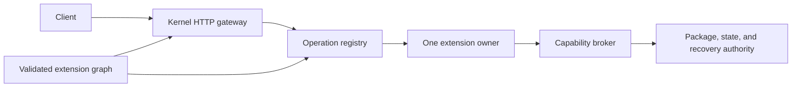

# 1. Architecture and compiled assemblies

NuTestServer is a microkernel-style modular monolith with a supported extension
boundary. Extensions own features and typed operations. The kernel owns the
invariants that an extension must not bypass: host lifecycle, authentication,
authorization, routing, limits, capability enforcement, package authority,
transactional state, recovery, diagnostics, and audit.

<!-- example-id: contrib-01-system-diagram; evidence: reference -->


The route table and extension graph are validated and frozen before listening.
See [`ServerApplication`](../../src/NuGet.TestServer/Hosting/ServerApplication.cs),
[`ExtensionCatalog`](../../src/NuGet.TestServer.Kernel/Hosting/ExtensionCatalog.cs),
and the [endpoint composition fitness
tests](../../tests/NuGet.TestServer.UnitTests/EndpointCompositionFitnessTests.cs).

## Compiled dependency graph

`A -> B` means project A directly references project B.

<!-- example-id: contrib-01-assembly-dag; evidence: reference -->
```text
NuGet.TestServer.Kernel -> NuGet.TestServer.Extensions.Sdk
NuGet.TestServer.Extensions.Official -> NuGet.TestServer.Extensions.Sdk
NuGet.TestServer -> NuGet.TestServer.Kernel
NuGet.TestServer -> NuGet.TestServer.Extensions.Official
NuGet.TestServer.Cli -> NuGet.TestServer
NuGet.TestServer.Extensions.TestKit -> NuGet.TestServer.Extensions.Sdk
NuTest.PackageStaging -> NuGet.TestServer.Extensions.Sdk
```

The project files are the primary evidence. The [assembly split fitness
tests](../../tests/NuGet.TestServer.UnitTests/OfficialAssemblySplitFitnessTests.cs)
also inspect compiled references and enforce that:

- the SDK has no implementation dependency;
- the kernel and official extension assembly do not reference each other;
- `NuGet.TestServer` is the only product composition root referencing both;
- official extensions cannot reference kernel, host, ASP.NET Core, storage, or
  routing implementations.

TestKit and Package Staging project files point only to the SDK. Their focused
packaging and Package Staging fitness tests enforce that narrower boundary; the
assembly-split fitness test does not currently derive those two edges.

The intentionally invalid [forbidden-reference
fixture](../../tests/NuGet.TestServer.ForbiddenReferenceFixture/NuGet.TestServer.ForbiddenReferenceFixture.csproj)
exists only to prove that trusted package loading rejects forbidden assembly
references.

## Public contracts

`NuGet.TestServer.Extensions.Sdk` 1.3.0 is the supported runtime contract
assembly. `NuGet.TestServer.Extensions.TestKit` 1.1.0 contains authoring and test
helpers. Both target `net10.0`, are locally packable, and are not externally
published. The SDK API and structural identity, both package/assembly identities, and
selected package assets are frozen by:

- [`PublicSdkContractTests`](../../tests/NuGet.TestServer.Extensions.Sdk.Tests/PublicSdkContractTests.cs);
- [`PackagingContractTests`](../../tests/NuGet.TestServer.Extensions.Sdk.Tests/PackagingContractTests.cs);
- [`Sdk.PublicApi.approved.txt`](../../tests/NuGet.TestServer.Extensions.Sdk.Tests/Snapshots/Sdk.PublicApi.approved.txt);
- [`sdk-v1.structural-contract.txt`](../../tests/NuGet.TestServer.Extensions.Sdk.Tests/Snapshots/sdk-v1.structural-contract.txt).

TestKit has no independent public-API or structural snapshot. Its tests freeze
its assembly identity, SDK-only dependency, and required package shape.

Types located in the SDK project are not necessarily public. For example,
`OperationResult` and `RouteReference` support internal composition but are absent
from the approved public API snapshot. Contributor code must compile against
exported contracts, not infer support from a source directory.

## Internal implementation

`NuGet.TestServer.Kernel` enforces policy and owns authoritative services.
`NuGet.TestServer.Extensions.Official` contains built-in feature owners.
`NuGet.TestServer` composes those assemblies and trusted external modules.
`NuGet.TestServer.Cli` is the command-line entry point. None of these assemblies
is a public extension contract.

Official and external extensions use the same SDK module, operation, route,
contribution, and capability contracts. Official code receives no private
authority escape; [extension fitness
tests](../../tests/NuGet.TestServer.UnitTests/ExtensionModuleFitnessTests.cs)
continuously enforce this boundary.

## Rationale and deferred behavior

The [architecture](../../design/microkernel-extension-architecture.md) and
[implementation review](../../design/microkernel-implementation-review.md)
explain why the repository adopted one-way dependencies and one active owner.
Their migration-era status text is historical when it differs from compiled
source and current tests.

There is no sidecar runtime, alternate-language host, dynamic route mutation,
hot reload, security sandbox, or multi-node coordination. Dedicated collectible
assembly load contexts provide dependency and cleanup isolation only.

---

[Contributor manual](README.md) | **Previous:** [Index](README.md) | **Next:** [Request lifecycle](02-request-lifecycle.md)
