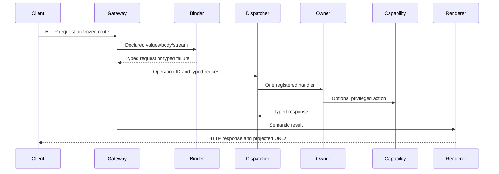

# 2. Request lifecycle

Every matched request follows a kernel-controlled path. Public extensions supply
declarations, binders, and typed owners; they do not receive `HttpContext`,
endpoint routing, middleware registration, or kernel services.

<!-- example-id: contrib-02-request-sequence; evidence: reference -->

## Startup: declarations become frozen endpoints

The public manifest declares operations and routes. A `RouteDeclaration` binds a
route identity to an operation identity and declares methods, path, access,
HEAD/body behavior, request and response bounds, and contract version. An
`IExtensionModule` registers matching handlers and binders. The separate
[Flavors fixture](../../tests/NuExtVault.SdkFixture/FlavorsExtension.cs)
demonstrates this supported shape.

Internally, [`PublicExtensionModuleAdapter`](../../src/NuExtVault/Hosting/PublicExtensionModuleAdapter.cs)
correlates public registrations with the manifest and materializes endpoint
descriptors. [`EndpointDescriptorValidator`](../../src/NuExtVault.Kernel/Kernel/Routing/EndpointDescriptorValidator.cs)
rejects invalid bindings, limits, access policy, reserved paths, semantic
collisions, and contract mismatches. [`KernelRouteTable`](../../src/NuExtVault.Kernel/Kernel/Routing/KernelRouteTable.cs)
orders the validated descriptors and freezes the host-scoped table.

Only [`KernelEndpointMapper`](../../src/NuExtVault.Kernel/Kernel/Routing/KernelEndpointMapper.cs)
maps ASP.NET endpoints. The [route coverage
tests](../../tests/NuExtVault.UnitTests/OperationRouteCoverageTests.cs)
prove that mapped routes and active operations agree.

## Middleware and binding

The host applies diagnostics, optional test instrumentation, then transport,
authentication, authorization, and throttling before binding. An unauthorized
malformed body is therefore rejected by security policy before JSON parsing; this
ordering is covered by [endpoint routing functional
tests](../../tests/NuExtVault.FunctionalTests/EndpointDescriptorRoutingTests.cs).

A public binder sees declared route values and headers, supplied query values, a
kernel-bounded body, or a non-buffering `StreamHandle`. Route declarations do
not currently declare a query-key allowlist; a binder may look up any supplied
query key. The adapter filters undeclared route values and headers.
[`OperationGateway`](../../src/NuExtVault.Kernel/Kernel/OperationGateway.cs)
applies the resolved request-byte limit, invokes the binder, and dispatches a
typed invocation. Binding failures render without invoking an owner.

Descriptor timeout and maximum-concurrency values are validated declarations.
The current gateway directly enforces request bytes, while concurrency queueing
and queue-wait deadlines are visibly enforced by the capability broker. JSON
and text response-size declarations are not directly enforced by the current
renderer; bounded content handles are enforced. Do not claim general per-route
timeout, concurrency, or response-size enforcement until implementation and
tests prove it.

## Dispatch and capabilities

[`OperationRegistry`](../../src/NuExtVault.Kernel/Kernel/OperationRegistry.cs)
requires one handler whose owner and CLR request/response types match the
resolved declaration. Unknown, missing, duplicate, inactive, or mismatched
registrations fail startup. Ordering is by stable operation ID, never discovery
order. [`OperationDispatcher`](../../src/NuExtVault.Kernel/Kernel/OperationDispatcher.cs)
checks types and cancellation, establishes operation attribution, and invokes
the sole owner.

Owners request privileged actions through capabilities. Handle acquisition
checks host, extension, grant, and capability interface/name pairing. Each call
then enforces its quota/queue bounds, cancellation, and audit attribution.
Chapter 4 covers this boundary.

## Rendering and URL projection

Built-in owners return `OperationResponse<T>` and may attach the internal,
transport-neutral `OperationResult`. Public owners can create only the narrower
`OperationResponse<T>.Success`. The kernel
alone maps semantic outcomes to status codes, headers, JSON, text, problem
documents, and bounded content handles in
[`OperationGateway`](../../src/NuExtVault.Kernel/Kernel/OperationGateway.cs)
and [`OperationErrorPolicy`](../../src/NuExtVault.Kernel/Kernel/OperationErrorPolicy.cs).

Internal documents may carry typed route references. During JSON serialization,
[`KernelUrlProjector`](../../src/NuExtVault.Kernel/Kernel/Routing/KernelUrlProjector.cs)
validates route and parameter identities, normalizes package values, escapes
components, and projects an absolute URL from direct or trusted-proxy request
facts. Public extensions select service-resource routes through manifest route
identities; they do not construct host-derived URLs.

Cancellation flows through binding, dispatch, owners, capabilities, and content
streaming. Known validation, package-limit, and capability-saturation failures
become typed errors; cancellation propagates and unexpected storage failures are
not converted into success. [Dispatch protocol
tests](../../tests/NuExtVault.FunctionalTests/OperationDispatchProtocolTests.cs)
freeze representative HTTP behavior.

---

[Contributor manual](README.md) | **Previous:** [Architecture](01-architecture-and-assemblies.md) | **Next:** [Extension composition](03-extension-composition.md)
